# Appointment Archetype Flow

Source: `Agent_Runtime_System_v1.md` — Step 4 Archetype 3 (Appointment), full build (Customer Psychology, Common Entry Scenarios, Full Conversation Journey Map, Data Collection Timing, Decision Tree, Conversion Path, Recovery Trigger Moments, Escalation Boundaries). Also draws on Step 0A Archetype 3, Step 0B §4/§7, Step 1D.0.5 (Module Responsibility Contract), Module 1 (Core Agent), Module 2 (Growth Agent, incl. A.0 Buying Stage Detection and §E Opportunity Detection), Module 3 §2/§2.1/§3 (Conversion Engine, Appointment flows), Module 4 (Recovery Engine).

This flowchart reflects the completed Step 4 Appointment build — Module Ownership is annotated at every handoff node, matching the depth of `Emergency_Archetype_Flow.md` and `Commerce_Archetype_Flow.md`.

```mermaid
flowchart TD
    Start([Message received — Appointment archetype]) --> Session["1A Session State Check"]
    Session --> Intent["1B Intent Classification"]

    Intent --> IntentModify{"Intent 04/06?<br/>Existing booking — reschedule or cancel"}
    IntentModify -->|Yes| CoreHandoff["Owner: Core Agent Support Handler (Module 1B)<br/>Full handoff at intake — Appointment stands down<br/>per Module 3 EC-07"]
    CoreHandoff --> Exit

    IntentModify -->|No| Complaint{"Intent 05?<br/>Complaint / trust-broken signal"}
    Complaint -->|Yes| ComplaintHandler["Owner: Core Agent Complaint Handler (Module 1C)<br/>Universal Psychology Override"]
    ComplaintHandler --> Exit

    Complaint -->|No| KnowsService{"Customer knows the service AND<br/>specifies enough to book directly?"}
    KnowsService -->|No| Growth["Owner: Growth Agent (Module 2)<br/>Discovery / Recommendation<br/>One guiding question, Freedom 4/10<br/>(Buying Stage Detection A.0)"]
    Growth --> KnowsService

    KnowsService -->|"Yes — Stage 3 Ready Buyer"| TrustCheck{"Trust objection or<br/>first-timer anxiety signal?"}
    TrustCheck -->|Yes| TrustHandle["Owner: Growth Agent — Objection Handling (Trust type)<br/>or warm reassurance"]
    TrustHandle --> Practitioner
    TrustCheck -->|No| Practitioner{"Practitioner-specific request?<br/>e.g. 'with Sarah'"}

    Practitioner -->|Yes| PractAvail["Owner: Conversion Engine —<br/>Availability Validation Layer (2.1)<br/>scoped to that practitioner's calendar"]
    Practitioner -->|No| AnyAvail["Owner: Conversion Engine —<br/>Availability Validation Layer (2.1)<br/>any available practitioner"]
    PractAvail --> SpecialReq
    AnyAvail --> SpecialReq{"Special request mentioned,<br/>not confirmable from Business Memory?"}

    SpecialReq -->|"Yes — safety/access-critical"| SafetyEsc["Owner: Core Agent — escalation path<br/>Priority 2, booking NOT finalized<br/>until human-confirmed"]
    SafetyEsc --> AvailCheck
    SpecialReq -->|"Yes — preference-only"| PrefNote["Owner: Core Agent — informational<br/>Priority 3, noted on booking,<br/>proceeds normally"]
    PrefNote --> AvailCheck
    SpecialReq -->|No| AvailCheck{"Calendar slot available<br/>at requested time?"}

    AvailCheck -->|No| ConflictOffer["Availability Conflict Handling:<br/>2-3 nearest alternatives,<br/>same-practitioner-first if requested"]
    ConflictOffer --> ConflictFit{"Alternative accepted?"}
    ConflictFit -->|"Yes"| Permission
    ConflictFit -->|"No — none fit"| ModeC["Mode C: Human Callback<br/>Priority 3 (Review)"]
    ModeC --> Exit

    AvailCheck -->|Yes| Permission{"'reserve slot' permission<br/>granted? (1D.1)"}
    Permission -->|Yes| ModeA["Mode A: Direct Booking<br/>Tier 3 fields + special request bundled"]
    Permission -->|No| SelfService{"appointment_selfservice_link_enabled<br/>= true AND integration exists?"}

    SelfService -->|Yes| ModeBSelf["Mode B: Guided Self-Service Booking<br/>Direct link to booking system"]
    ModeBSelf --> Exit
    SelfService -->|No| ModeBRequest["Mode B: Request Booking<br/>Pending record, human confirms"]
    ModeBRequest --> Exit

    ModeA --> TierGate{"Tier 2/3 fields VALID<br/>or INVALID-FLAGGED?"}
    TierGate -->|No| Correction["Correction Flow (§7.3):<br/>one flag, one re-attempt,<br/>then accept-with-flag"]
    Correction --> TierGate
    TierGate -->|Yes| Confirmed["Booking CONFIRMED<br/>Explicit confirmation language stated"]

    Confirmed --> PostBooking["Owner: Growth Agent — Opportunity Detection (E)<br/>Post-booking membership/package upsell check<br/>ONE offer only, optional, never re-offered"]
    PostBooking --> Exit

    Exit(["Step 1G Exit —<br/>End State 1/2/5 per outcome<br/>Recovery Engine (Module 4) evaluates if eligible"])

    subgraph NoShow["No-Show Recovery (system-triggered, not live-conversation)"]
        NS1["Scheduled appointment time passes"] --> NS2{"Check-in/completion signal<br/>received from business system?"}
        NS2 -->|No| NS3["No-Show Recovery Trigger fires —<br/>NEW, archetype-specific (not Module 4 §2's<br/>pre-booking table, not Module 4 §8's<br/>enterprise sources A-I)"]
        NS3 --> NS4["Single non-judgmental follow-up touch,<br/>default same-day/end-of-business-hours —<br/>NOT the standard 4-step cadence"]
        NS4 --> NS5["Standard Module 4 §5/§6 suppression<br/>and stop-condition machinery applies<br/>unmodified from that point on"]
        NS2 -->|Yes| NS6["No trigger — appointment completed normally"]
    end

    subgraph Legend["Module Ownership Legend (Step 1D.0.5)"]
        L1["Core Agent: intake handoffs (existing-booking<br/>reschedule/cancel, complaints, FAQ, safety/access-<br/>critical special-request escalation)"]
        L2["Growth Agent: discovery, recommendation, trust<br/>objection handling, post-booking upsell — never<br/>executes the booking itself"]
        L3["Conversion Engine: Mode A/B/C execution +<br/>Availability Validation Layer (incl. practitioner-<br/>scoped check) — re-routes objections, never resolves"]
        L4["Recovery Engine: standard pre-booking trigger<br/>(Module 4 §2, used as-is) + new no-show trigger<br/>(this build's addition, layered on top of Module 4)"]
    end
```

