# Commerce Archetype Flow (Ecommerce + Restaurant)

Source: `Agent_Runtime_System_v1.md` — Step 4 Archetype 2 (Commerce), both sub-variants, full build (Customer Psychology, Common Entry Scenarios, Full Conversation Journey Map, Data Collection Timing, Decision Tree, Conversion Path, Recovery Trigger Moments, Escalation Boundaries). Also draws on Step 0A Archetype 2, Step 0B §4/§7, Step 1D.0.5 (Module Responsibility Contract), Module 1 (Core Agent), Module 2 (Growth Agent), Module 3 §2/§2.1/§3 (Conversion Engine), Module 4 (Recovery Engine).

This flowchart reflects the completed Step 4 Commerce build — both sub-variants are shown in full, with Module Ownership annotated on each handoff node.

```mermaid
flowchart TD
    Start([Message received — Commerce archetype]) --> Session["1A Session State Check"]
    Session --> Intent["1B Intent Classification"]
    Intent --> Variant{"Ecom or Restaurant sub-variant?<br/>(config + message content)"}

    %% ============ ECOMMERCE ============
    Variant -->|Ecommerce| E_Intent04{"Intent 04?<br/>Existing customer, order issue"}
    E_Intent04 -->|Yes| E_CoreHandoff["Owner: Core Agent Support Handler (Module 1B)<br/>Full handoff at intake — Commerce stands down"]
    E_CoreHandoff --> Exit

    E_Intent04 -->|No| E_Complaint{"Intent 05?<br/>Complaint / trust-broken signal"}
    E_Complaint -->|Yes| E_ComplaintHandler["Owner: Core Agent Complaint Handler (Module 1C)<br/>Universal Psychology Override"]
    E_ComplaintHandler --> Exit

    E_Complaint -->|No| E_Blocking{"Factual Blocking question present?<br/>e.g. 'do you ship internationally'"}
    E_Blocking -->|Yes| E_FAQ["Owner: Core Agent FAQ — answer from<br/>Business Memory inline, never guess"]
    E_FAQ --> E_Buying
    E_Blocking -->|No| E_Buying{"Ready Buyer (Intent 03)<br/>or buying signal present?"}

    E_Buying -->|No| E_Growth["Owner: Growth Agent (Module 2)<br/>Discovery / Recommendation<br/>per Buying Stage Detection (A.0)<br/>Freedom 3/10: recommend only if asked"]
    E_Growth --> E_Buying

    E_Buying -->|Yes| E_Discount{"Discount request?"}
    E_Discount -->|Yes| E_DiscountHandle["Owner: Growth Agent — Objection Handling<br/>Value reframe + discount permission check (1D.1)<br/>No permission → Human Handoff P3"]
    E_DiscountHandle --> E_Competitor
    E_Discount -->|No| E_Competitor{"Competitor comparison?"}

    E_Competitor -->|Yes| E_CompHandle["Owner: Growth Agent — Objection Handling<br/>Value-focused, KB-confirmed only, never attacks"]
    E_CompHandle --> E_Upsell
    E_Competitor -->|No| E_Upsell{"Upsell/bundle moment present?<br/>KB-confirmed complementary-item mapping only"}

    E_Upsell -->|Yes| E_UpsellOffer["Owner: Growth Agent — Opportunity Detection (E)<br/>One offer, optional, never re-offered"]
    E_UpsellOffer --> E_CartValue
    E_Upsell -->|No| E_CartValue{"Cart value ≥ configured<br/>cart_value_escalation_threshold?"}

    E_CartValue -->|"Yes (configured & met)"| E_ModeC["Mode C: Lead Handoff to Human<br/>Priority 2 (Standard)"]
    E_ModeC --> Exit
    E_CartValue -->|"No (unset or below)"| E_Permission{"'create cart' permission<br/>granted? (1D.1)"}

    E_Permission -->|No| E_ModeB["Mode B: Guided Product Link<br/>(first-class path, not a fallback)"]
    E_ModeB --> Exit
    E_Permission -->|Yes| E_Stock{"Availability Validation Layer (2.1):<br/>stock confirmed for exact item/variant?"}

    E_Stock -->|"No — out of stock"| E_StockFallback["Ordered fallback:<br/>1. Alternative variant, disclosed<br/>2. Back-in-stock notify (if configured)<br/>3. Mode C, Priority 3"]
    E_StockFallback --> Exit
    E_Stock -->|"No — general API error"| E_ModeB
    E_Stock -->|Yes| E_Gift{"Gift purchase?"}

    E_Gift -->|Yes| E_GiftCapture["Dual Tier 3 capture:<br/>buyer info first, recipient info second<br/>(two distinct, separately-framed moments)"]
    E_GiftCapture --> E_ModeA
    E_Gift -->|No| E_ModeA["Mode A: Agent Cart Creation<br/>Total cost confirmed upfront"]
    E_ModeA --> Exit

    %% ============ RESTAURANT ============
    Variant -->|Restaurant| R_Modify{"Modification of an existing,<br/>already-confirmed reservation?"}
    R_Modify -->|Yes| R_CoreHandoff["Owner: Core Agent Support Handler (Module 1B)<br/>per Module 3 EC-07 — full handoff"]
    R_CoreHandoff --> Exit

    R_Modify -->|No| R_Scope{"Actually a delivery/pickup/<br/>catering-order request, not a reservation?"}
    R_Scope -->|"Yes, Ecom sub-variant active"| E_Buying
    R_Scope -->|"Yes, no Ecom sub-variant"| R_NoDelivery["Owner: Core Agent FAQ —<br/>state plainly delivery isn't offered"]
    R_NoDelivery --> Exit

    R_Scope -->|No| R_Complaint{"Intent 05?<br/>Complaint / trust-broken signal"}
    R_Complaint -->|Yes| R_ComplaintHandler["Owner: Core Agent Complaint Handler (Module 1C)"]
    R_ComplaintHandler --> Exit

    R_Complaint -->|No| R_Growth["Owner: Growth Agent (if occasion/<br/>recommendation question present)<br/>or Core Agent FAQ (pure informational)"]
    R_Growth --> R_PartySize{"Party size ≥ 10?"}

    R_PartySize -->|Yes| R_ModeC["Mode C: Event/Catering Handoff<br/>Priority 2 (Standard)"]
    R_ModeC --> Exit
    R_PartySize -->|No| R_TimePassed{"Requested time already passed?"}

    R_TimePassed -->|Yes| R_TimeCorrect["Natural correction prompt:<br/>'did you mean tonight, or [next occurrence]?'"]
    R_TimeCorrect --> R_PartySize
    R_TimePassed -->|No| R_Dietary{"Dietary restriction mentioned,<br/>not confirmable from Business Memory?"}

    R_Dietary -->|"Yes — safety-relevant (allergy)"| R_SafetyEsc["Owner: Core Agent — escalation<br/>Priority 2, pre-arrival kitchen confirmation<br/>required, never guessed"]
    R_SafetyEsc --> R_Private
    R_Dietary -->|"Yes — preference-only"| R_PrefNote["Owner: Core Agent — informational<br/>Priority 3, noted on reservation"]
    R_PrefNote --> R_Private
    R_Dietary -->|No| R_Private{"Private event / catering inquiry?"}

    R_Private -->|Yes| R_ModeC
    R_Private -->|No| R_Avail{"Availability Validation Layer (2.1):<br/>table/slot available at requested time?"}

    R_Avail -->|Yes| R_ModeA["Mode A: Reservation Flow, direct<br/>'You're confirmed for [time], table for [size]'"]
    R_ModeA --> Exit
    R_Avail -->|No| R_Waitlist{"waitlist_enabled config flag true?"}

    R_Waitlist -->|Yes| R_ModeB["Mode B: Waitlist Entry<br/>Tier 3 fields collected"]
    R_ModeB --> Exit
    R_Waitlist -->|No| R_AltTime["State unavailability plainly,<br/>offer nearest actually-available alternative"]
    R_AltTime --> Exit

    %% ============ EXIT ============
    Exit(["Step 1G Exit —<br/>End State 1/2/4/5 per outcome<br/>Recovery Engine (Module 4) evaluates if eligible"])

    subgraph Legend["Module Ownership Legend (Step 1D.0.5)"]
        L1["Core Agent: intake handoffs (existing-customer/<br/>reservation-modification, complaints, FAQ, dietary escalation)"]
        L2["Growth Agent: discovery, recommendation, objection<br/>handling (discount/competitor), upsell — never executes"]
        L3["Conversion Engine: Mode A/B/C execution only —<br/>re-routes any objection/persuasion moment, never resolves it"]
        L4["Recovery Engine: evaluated only at Step 1G exit,<br/>per Module 4's existing trigger definitions — not shown<br/>as inline nodes above, referenced at Exit"]
    end
```

