# Consultation Archetype Flow (Marketing Agency + Travel Agency)

Source: `Agent_Runtime_System_v1.md` — Step 4 Archetype 5 (Consultation), full build, both sub-variants (Customer Psychology, Common Entry Scenarios, Full Conversation Journey Map, Data Collection Timing, Decision Tree — including the Discovery-Depth-Is-Enough framework — Conversion Path, Recovery Trigger Moments, Escalation Boundaries). Also draws on Step 0A Archetype 5, Step 2 §3 (8/10 freedom worked examples), Step 0B §4/§7, Step 1D.0.5 (Module Responsibility Contract), Module 1 (Core Agent), Module 2 (Growth Agent, incl. A/B/C Discovery/Recommendation/Objection Handling), Module 3 §3 (Conversion Engine, Consultation Score Gate Logic), Module 4 §2/§4 (Recovery Engine, score-aware messaging).

This is the FINAL archetype flowchart — with this rebuild, all five archetypes (Emergency, Commerce, Appointment, Engagement, Consultation) have complete Step 4 flowcharts. Marketing Agency and Travel Agency are two fully independent sub-variants sharing only the Discovery-Depth-Is-Enough framework and Module 3's score-gate mechanics — shown as two clearly-separated subgraphs in one file, consistent with `Commerce_Archetype_Flow.md`'s precedent for two-sub-variant archetypes.

```mermaid
flowchart TD
    Start([Message received — Consultation archetype]) --> Session["1A Session State Check"]
    Session --> Intent["1B Intent Classification"]
    Intent --> Variant{"Marketing Agency or<br/>Travel Agency sub-variant?"}

    Exit(["Step 1G Exit —<br/>End State 1/2/5 per outcome<br/>Recovery Engine (Module 4) evaluates if eligible,<br/>score-aware messaging per Module 4 §4"])

    %% ============ MARKETING AGENCY ============
    Variant -->|Marketing Agency| M_Intent04{"Intent 04?<br/>Existing client, campaign/project status"}
    M_Intent04 -->|Yes| M_CoreHandoff["Owner: Core Agent Support Handler (Module 1B)<br/>Full handoff at intake"]
    M_CoreHandoff --> Exit

    M_Intent04 -->|No| M_Complaint{"Intent 05?<br/>Complaint"}
    M_Complaint -->|Yes| M_ComplaintHandler["Owner: Core Agent Complaint Handler (Module 1C)"]
    M_ComplaintHandler --> Exit

    M_Complaint -->|No| M_Trust{"Blocking trust objection<br/>alongside booking intent? (MI-03)"}
    M_Trust -->|Yes| M_TrustHandle["Owner: Growth Agent — Objection Handling<br/>(Trust type) — resolve first"]
    M_TrustHandle --> M_Ready
    M_Trust -->|No| M_Guarantee{"Outcome-guarantee or high-<br/>liability financial claim request?"}
    M_Guarantee -->|Yes| M_NoGuarantee["Owner: Growth Agent — Risk-Based<br/>Freedom Reduction (2.2) — no<br/>guarantee ever made"]
    M_NoGuarantee --> M_Ready
    M_Guarantee -->|No| M_Ready{"Explicit Intent 03<br/>signal already given?"}

    M_Ready -->|"Yes — SHORTCUT"| M_ScoreGateEntry["Owner: hands to Conversion Engine<br/>Score Gate — discovery stops immediately,<br/>whatever data exists is used"]
    M_Ready -->|No| M_Pricing{"Pricing question?"}
    M_Pricing -->|"Decision-conditional<br/>('tell me price, I'll decide')"| M_PriceRefuse["Owner: Growth Agent — refuse to quote<br/>(action-permission boundary) — treated<br/>as implicit readiness signal"]
    M_PriceRefuse --> M_ScoreGateEntry
    M_Pricing -->|"Ordinary curiosity"| M_PriceAnswer["General-range answer if KB allows,<br/>no shortcut"]
    M_PriceAnswer --> M_Discovery
    M_Pricing -->|No| M_Discovery["Owner: Growth Agent — Adaptive Discovery<br/>(Freedom 8/10): Situation → Problem →<br/>Implication. Vague answer? Challenge<br/>ONCE per topic, never twice on same point"]

    M_Discovery --> M_DepthCheck{"DISCOVERY-DEPTH-IS-ENOUGH:<br/>Implication floor reached AND<br/>Confidence Gate HIGH on required<br/>scoring-input fields?"}
    M_DepthCheck -->|No| M_Discovery
    M_DepthCheck -->|Yes| M_Invite["Owner: Growth Agent — proactive<br/>invitation offered ('sounds like a fit...')"]
    M_Invite --> M_ScoreGateEntry

    M_ScoreGateEntry --> M_ScoreConfig{"consultation_scoring_enabled?"}
    M_ScoreConfig -->|No| M_ModeB["Mode B: Open Booking, no gate"]
    M_ModeB --> Exit
    M_ScoreConfig -->|Yes| M_Tier{"Score tier?<br/>(scoring mechanism itself out of scope)"}

    M_Tier -->|"< 50"| M_Nurture["Nurture — care-based framing,<br/>no self-service booking, never<br/>reveals a score"]
    M_Nurture --> Exit
    M_Tier -->|"50-69"| M_ModeA["Mode A: standard scored booking"]
    M_ModeA --> Exit
    M_Tier -->|"70-84"| M_ModeAHigh["Mode A: IDENTICAL booking mechanics<br/>+ real-time internal sales-team alert<br/>(NEW — extends existing WF-302 alert<br/>to fire at initial scoring)"]
    M_ModeAHigh --> Exit
    M_Tier -->|"≥ 85"| M_ModeC["Mode C: Human Priority<br/>Priority 1 (Immediate) — already<br/>defined by Module 3, cross-referenced"]
    M_ModeC --> Exit

    %% ============ TRAVEL AGENCY ============
    Variant -->|Travel Agency| T_Intent04{"Intent 04?<br/>Existing client, booking status"}
    T_Intent04 -->|Yes| T_CoreHandoff["Owner: Core Agent Support Handler (Module 1B)<br/>Full handoff at intake"]
    T_CoreHandoff --> Exit

    T_Intent04 -->|No| T_Complaint{"Intent 05?<br/>Complaint"}
    T_Complaint -->|Yes| T_ComplaintHandler["Owner: Core Agent Complaint Handler (Module 1C)"]
    T_ComplaintHandler --> Exit

    T_Complaint -->|No| T_Ready{"Explicit Intent 03<br/>signal already given?"}
    T_Ready -->|"Yes — SHORTCUT"| T_ScoreGateEntry["Owner: hands to Conversion Engine<br/>Score Gate — same override as<br/>Marketing Agency"]
    T_Ready -->|No| T_Destination{"Specific destination named?"}

    T_Destination -->|Yes| T_KBCheck{"Confirmed in Business Memory<br/>with genuine detail?"}
    T_KBCheck -->|Yes| T_Tailored["Owner: Growth Agent — tailored,<br/>KB-backed matching"]
    T_Tailored --> T_GroupCheck
    T_KBCheck -->|"No — honest-limitation branch"| T_Honest["Owner: Growth Agent — 'I don't have<br/>confirmed detail on that specifically'<br/>(Module 2 B.1 pattern, never fabricates)"]
    T_Honest --> T_AltExists{"Comparable alternative<br/>in KB?"}
    T_AltExists -->|Yes| T_GroupCheck
    T_AltExists -->|No| T_ModeCHandoff["Mode C: connect with a specialist<br/>Priority 3 (Review)"]
    T_ModeCHandoff --> Exit
    T_Destination -->|No| T_GroupCheck{"Large/complex group trip?<br/>(e.g. 20-person destination wedding)"}

    T_GroupCheck -->|Yes| T_HigherStakes["Higher-stakes-wins-ties layer:<br/>routes toward human involvement<br/>REGARDLESS of numeric score<br/>(archetype-level, on top of Module 3)"]
    T_HigherStakes --> T_Guarantee
    T_GroupCheck -->|No| T_Guarantee{"Outcome-guarantee request<br/>outside business's control?<br/>(e.g. weather)"}

    T_Guarantee -->|Yes| T_NoGuarantee["Owner: Growth Agent — no guarantee<br/>made, honest limitation stated"]
    T_NoGuarantee --> T_Pricing
    T_Guarantee -->|No| T_Pricing{"Pricing question?"}

    T_Pricing -->|"Decision-conditional"| T_PriceRefuse["Refuse to quote — treated as<br/>implicit readiness signal"]
    T_PriceRefuse --> T_ScoreGateEntry
    T_Pricing -->|"Ordinary curiosity"| T_PriceAnswer["General-range answer, no shortcut"]
    T_PriceAnswer --> T_Discovery
    T_Pricing -->|No| T_Discovery["Owner: Growth Agent — Adaptive Discovery<br/>(Freedom 8/10): Situation → Problem →<br/>Implication (occasion-stakes framing).<br/>Challenge ONCE per topic max"]

    T_Discovery --> T_DepthCheck{"DISCOVERY-DEPTH-IS-ENOUGH:<br/>same shared framework as<br/>Marketing Agency"}
    T_DepthCheck -->|No| T_Discovery
    T_DepthCheck -->|Yes| T_Invite["Owner: Growth Agent — proactive<br/>invitation offered"]
    T_Invite --> T_ScoreGateEntry

    T_ScoreGateEntry --> T_ScoreConfig{"consultation_scoring_enabled?"}
    T_ScoreConfig -->|No| T_ModeB["Mode B: Open Booking, no gate"]
    T_ModeB --> Exit
    T_ScoreConfig -->|Yes| T_Tier{"Score tier?"}

    T_Tier -->|"< 50"| T_Nurture["Nurture — care-based framing"]
    T_Nurture --> Exit
    T_Tier -->|"50-69"| T_ModeA["Mode A: standard scored booking"]
    T_ModeA --> Exit
    T_Tier -->|"70-84"| T_ModeAHigh["Mode A: IDENTICAL booking mechanics<br/>+ real-time internal sales-team alert"]
    T_ModeAHigh --> Exit
    T_Tier -->|"≥ 85"| T_ModeC["Mode C: Human Priority, Priority 1"]
    T_ModeC --> Exit

    subgraph Legend["Module Ownership Legend (Step 1D.0.5) + Discovery-Depth-Is-Enough"]
        L1["Core Agent: intake handoffs (existing-client<br/>status, complaints) — same pattern both sub-variants"]
        L2["Growth Agent: ALL adaptive discovery, objection<br/>handling, destination matching, proactive invitation<br/>— handoff trigger is STILL Intent 03 (Step 1E),<br/>never a second Consultation-specific signal"]
        L3["Conversion Engine: Score Gate + Mode A/B/C<br/>execution only — scoring MECHANISM itself is<br/>out of scope everywhere in this document"]
        L4["Recovery Engine: existing score-aware cadence<br/>(Module 4 §4), used as-is — not redefined here"]
        L5["Discovery-Depth-Is-Enough = Implication-stage SPIN<br/>floor + Confidence Gate HIGH on scoring-input fields,<br/>shortcut by Intent 03 readiness signal (Step 1E) —<br/>identical rule, sub-variant-specific example content"]
    end
```

