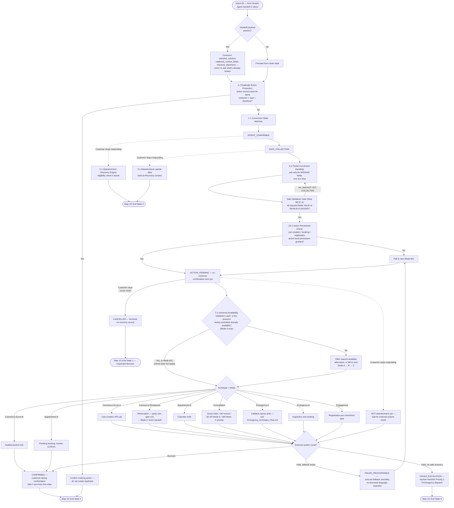

# Conversion Engine Flow (Module 3)

Source: `Agent_Runtime_System_v1.md` — Step 3 Module 3, Sections 1.1 (State Machine), 1.2 (Duplicate Protection), 2 (Modes Table), 2.1 (Universal Availability Validation Layer), 3 (Per-Archetype Flows), 4.1 (Partial Conversion), 5 (Failure Handling), 5.1 (Abandonment Detection).

All modes per archetype, unified through one state machine.

