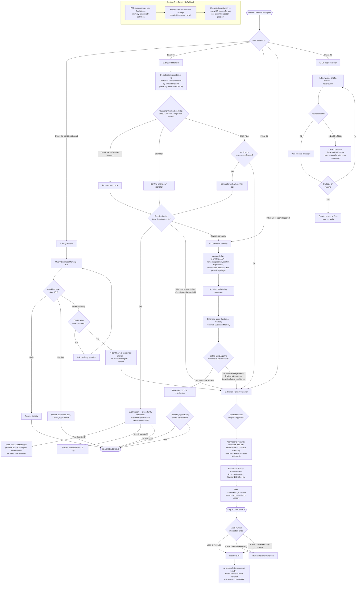

# Core Agent Flow (Module 1)

Source: `Agent_Runtime_System_v1.md` — Step 3 Module 1, Sections A–E plus B.1, Customer Verification Rule, Escalation Priority Classification, Off-Topic Counter Reset Rule.

All 5 Core Agent sub-flows. Core Agent is always active — no module gate.

