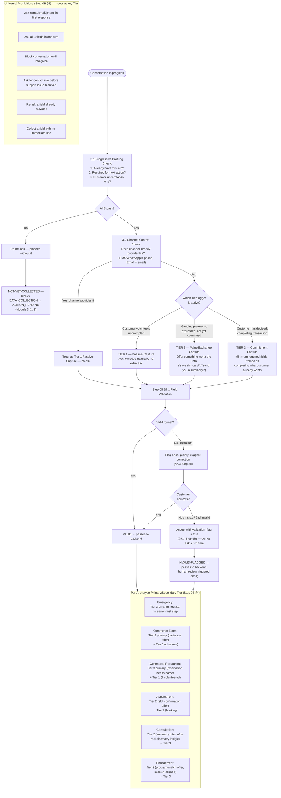

# Data Collection Map

Source: `Agent_Runtime_System_v1.md` — Step 0B (Natural Data Collection Doctrine, Sections 3, 3.1, 3.2, 4, 5, 7) and the per-archetype mapping table (Step 0B Section 4).

When and how contact info is collected per archetype, including the Progressive Profiling and Channel Context rules, and the Validation Gate before backend submission.

