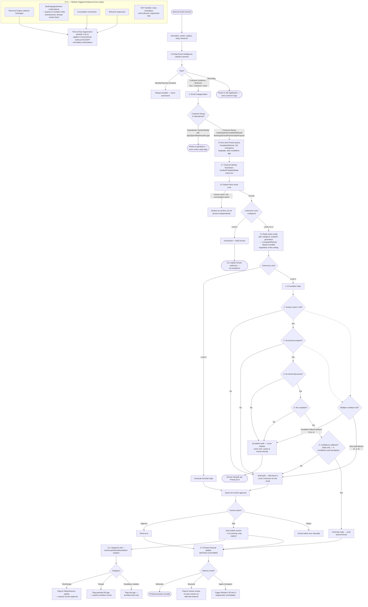

# Email Manager Flow (Module 5)

Source: `Agent_Runtime_System_v1.md` — Step 3 Module 5, Sections 2.1–2.9 (Inbox Intelligence Model), 3 (Autonomy Levels), 3.2 (Reply Style: Scripted vs. Generative), 3.3 (Level 2 Learning Loop, renumbered from 3.1 in Batch 3 Round 4), 4 (5-Condition Gate), 5 (Categorization), 6 (Confidence), 7/7.1 (Outbound Scope + Campaign Boundary), 8 (Edge Cases).

All 3 autonomy levels, unified through the same intake pipeline.

