# Emergency Archetype Flow

Source: `Agent_Runtime_System_v1.md` — Step 4, Archetype 1 (Emergency Engine), Sections 1–8. The only archetype with a complete Step 4 build as of this pass; other archetype flowcharts in this folder are stubs pending their own Step 4 builds.

Full conversation journey: happy path plus every branch (life-safety hazard, non-emergency/quote request, out-of-zone, DIY, on-behalf-of, complaint mid-emergency, human-unavailable).

```mermaid
flowchart TD
    Start([Message received]) --> Session["1A Session State Check"]
    Session --> Hazard{"Genuine life-safety hazard?<br/>(gas, sparking, structural risk)"}

    Hazard -->|Yes| SafetyFirst["Immediate safety guidance FIRST —<br/>parallel data collection"]
    SafetyFirst --> P1Escalate["Escalation Priority 1<br/>(Module 1 §D)"]

    Hazard -->|No| Complaint{"Complaint / trust-broken<br/>signal? (Priority 2)"}
    Complaint -->|Yes| DeEscalate["Core Agent Complaint Handler FIRST —<br/>safety check still runs in parallel<br/>if applicable"]
    DeEscalate --> Resume[Resume triage after de-escalation]

    Complaint -->|No| OnBehalf{Acting on behalf of<br/>someone else?}
    OnBehalf -->|Yes| Intermediary["Collect affected party's location +<br/>a reachable contact (caller's own<br/>number acceptable) — proceed as<br/>authorized intermediary"]
    Intermediary --> Active

    OnBehalf -->|No| Active{"Active, happening-now<br/>problem?"}

    Active -->|No| QuoteCheck{"FLAG 1: Research/quote request,<br/>no active issue?"}
    QuoteCheck -->|Yes| NonEmergency["Non-Emergency / Quote Request branch:<br/>answer factually from KB (Core Agent FAQ)<br/>— no manufactured urgency"]
    NonEmergency --> InspectionOffer["Offer Inspection Slot Booking<br/>(Conversion Mode B) — NOT Callback Queue"]
    InspectionOffer --> InspectFlow["Collect preferred date/time +<br/>Tier 3 fields → book calendar_event_id"]
    InspectFlow --> ExitQuote(["Step 1G End State 1"])

    QuoteCheck -->|No, non-urgent but<br/>solution-aware| SoftTiming["Standard triage, but confirm<br/>actual timing constraint before<br/>setting any window"]
    SoftTiming --> LocationPhone

    Active -->|Yes| DIY{"DIY request?<br/>('how do I fix this myself')"}
    DIY -->|Yes| DIYInfo["Agent MAY give KB-confirmed safety info —<br/>does NOT skip triage question<br/>(DIY ask ≠ decline of professional help)"]
    DIYInfo --> LocationPhone

    DIY -->|No| Zone{Out of service zone?}
    Zone -->|Yes| ZoneMessage["State plainly once location known:<br/>'We don't currently service [area]' +<br/>referral if configured"]
    ZoneMessage --> ExitZone(["Step 1G End State 1 —<br/>honest answer = completed job,<br/>NOT a failed conversion"])

    Zone -->|No| LocationPhone["§4 Data Collection Timing:<br/>Location + phone, Tier 3 only,<br/>NO earn-it-first step<br/>(collected in parallel if hazard active)"]

    LocationPhone --> ValCheck{"Validation (Step 0B §7.1)<br/>passes?"}
    ValCheck -->|Phone invalid| PhoneCorrect["Flag once, one re-attempt,<br/>then accept with validation_flag"]
    PhoneCorrect --> LocPermCheck
    ValCheck -->|Location unparseable,<br/>2nd attempt also fails| LocFallback["FIX: accept with flag,<br/>do NOT block dispatch —<br/>proceed with unparsed text,<br/>mark record for immediate<br/>human review (Priority 1)"]
    LocFallback --> LocPermCheck
    ValCheck -->|Valid| LocPermCheck

    LocPermCheck["1D.1 Action Permission Check:<br/>job queue / dispatch permission?"]
    LocPermCheck -->|Granted| DupCheck["Module 3 §1.2 Duplicate Action<br/>Protection check"]
    LocPermCheck -->|Not granted| ModeC[Conversion Mode C —<br/>Human Callback/Escalation]

    DupCheck -->|Existing entry found| ConfirmExisting["Confirm existing queue entry —<br/>do not duplicate"]
    DupCheck -->|New| HumanAvail

    HumanAvail{"FLAG 2: Human available<br/>to receive dispatch?"}
    HumanAvail -->|Yes| StandardWindow["State time window: 'technician<br/>will call within 15 minutes'"]
    HumanAvail -->|No| Unavailable["Human Queue Unavailable branch:<br/>never say 'no one available' + stop"]
    Unavailable --> UnavailSafety{Genuine safety risk?}
    UnavailSafety -->|Yes| SurfaceAltContact["Provide after_hours_emergency_contact<br/>if configured (Appendix A) —<br/>never withhold a safer alternative"]
    UnavailSafety -->|No| AdjustedWindow["Communicate actual next available<br/>window — never promise what<br/>can't be honored"]

    StandardWindow --> CreateQueue["Create Callback Queue entry<br/>(Conversion Engine Mode A)"]
    SurfaceAltContact --> CreateQueue
    AdjustedWindow --> CreateQueue
    CreateQueue --> QueuePriority["Escalation still logged at<br/>Priority 1 regardless of<br/>communicated timing"]

    QueuePriority --> DispatchResult{Dispatch action<br/>succeeds?}
    DispatchResult -->|Yes| Confirmed(["CONFIRMED —<br/>Step 1G End State 1"])
    DispatchResult -->|Fails| DispatchFail["Module 3 §5: highest-severity<br/>failure case — immediate Human<br/>Handoff Priority 1, no silent retry"]
    DispatchFail --> ExitHandoff(["Step 1G End State 5"])

    ModeC --> ExitHandoff
    ConfirmExisting --> Confirmed

    Confirmed -.->|No response within<br/>callback window| RecoveryTrigger["Module 4 Recovery Trigger:<br/>15min → 6hr → 24hr cadence"]
    RecoveryTrigger -.->|Customer confirms help<br/>arrived, or DIY self-resolved| NonTrigger(["Non-trigger — Step 1G<br/>End State 1, not eligible"])
```

