# Engagement Archetype Flow

Source: `Agent_Runtime_System_v1.md` — Step 4 Archetype 4 (Engagement), full build (Customer Psychology, Common Entry Scenarios, Full Conversation Journey Map, Data Collection Timing, Decision Tree, Conversion Path, Recovery Trigger Moments, Escalation Boundaries). Also draws on Step 0A Archetype 4, Step 0B §4/§7, Step 1D.0.5 (Module Responsibility Contract), Module 1 (Core Agent), Module 2 (Growth Agent, incl. A.0/EC-01 and §E Opportunity Detection), Module 3 §3 (Conversion Engine, Engagement flows), Module 4 (Recovery Engine).

**Structural note (unlike every other archetype flowchart in this set):** Engagement has no single conversion type — this diagram represents a shared Entry/Trust-Building opening feeding into FOUR parallel, fully-specified paths (Donate, Volunteer, Attend, Passive Supporter), each shown as its own subgraph with genuinely distinct logic, not a single flow with a swapped label. One flowchart file was judged clearer than three separate linked files, consistent with how `Commerce_Archetype_Flow.md` represents two sub-variants in one file — the shared Entry logic all four paths depend on would otherwise need to be duplicated or cross-referenced across three separate files.

```mermaid
flowchart TD
    Start([Message received — Engagement archetype]) --> Session["1A Session State Check"]
    Session --> Intent["1B Intent Classification"]

    Intent --> Intent04{"Intent 04?<br/>Existing donor/volunteer record<br/>(status, receipt, correction)"}
    Intent04 -->|Yes| CoreHandoff["Owner: Core Agent Support Handler (Module 1B)<br/>Full handoff at intake — Engagement stands down"]
    CoreHandoff --> Exit

    Intent04 -->|No| Complaint{"Intent 05?<br/>Complaint / trust-broken signal"}
    Complaint -->|Yes| ComplaintHandler["Owner: Core Agent Complaint Handler (Module 1C)<br/>Universal Psychology Override"]
    ComplaintHandler --> Exit

    Complaint -->|No| ReadySignal{"Explicit Ready-level signal<br/>for a specific conversion type?"}
    ReadySignal -->|"Yes — skip trust-building"| TypeRoute{"Which type?"}
    ReadySignal -->|No| TrustBuild["Owner: Growth Agent<br/>Trust-Building exchange:<br/>SPECIFIC concrete impact info,<br/>no ask yet"]
    TrustBuild --> SignalCheck{"After this exchange, does a<br/>capacity/interest signal now exist?<br/>(re-evaluated per message, not turn-count)"}
    SignalCheck -->|Donate| TypeRoute
    SignalCheck -->|Volunteer| TypeRoute
    SignalCheck -->|Attend| TypeRoute
    SignalCheck -->|"No signal — stays at info level"| PassiveEntry

    TypeRoute -->|Donate| DonateEntry
    TypeRoute -->|Volunteer| VolunteerEntry
    TypeRoute -->|Attend| AttendEntry

    Exit(["Step 1G Exit —<br/>End State 1/2/5 per outcome<br/>Recovery Engine (Module 4) evaluates if eligible<br/>(NEVER for Passive Supporter — see Legend)"])

    subgraph Donate["DONATE PATH"]
        DonateEntry["Owner: Growth Agent"] --> Tribute{"Tribute/memorial donation?<br/>'in memory of' / 'in honor of'"}
        Tribute -->|Yes| TributeCapture["Donor Tier 3 → Honoree name<br/>(Tier 3, required) → Honoree<br/>contact (Tier 3, OPTIONAL)"]
        Tribute -->|No| MissionFit
        TributeCapture --> MissionFit{"Genuine mission-fit<br/>established?"}
        MissionFit -->|No| ContinueTrust["Continue trust-building —<br/>no ask yet"]
        ContinueTrust --> MissionFit
        MissionFit -->|Yes| CalibratedAsk["Calibrated ask: gift option<br/>OFFERED ALONGSIDE a genuine<br/>non-ask option, never binary"]
        CalibratedAsk --> AskResponse{"Customer responds<br/>positively to the ask?"}
        AskResponse -->|"No — declines or picks non-ask"| DonateToPassive["Route to Passive Supporter<br/>(NOT a failed conversation)"]
        AskResponse -->|Yes| DonatePermission{"Donation registration<br/>permission granted? (1D.1)"}
        DonatePermission -->|Yes| DonateModeA["Mode A: Direct Registration"]
        DonatePermission -->|No| DonateModeB["Mode B: Guided to Form"]
        DonateModeA --> DonateTier3{"Tier 3 fields VALID<br/>or INVALID-FLAGGED?"}
        DonateTier3 -->|No| DonateCorrection["Correction Flow:<br/>one flag, one re-attempt"]
        DonateCorrection --> DonateTier3
        DonateTier3 -->|Yes| DonateConfirmed["Registration CONFIRMED"]
    end
    DonateConfirmed --> Exit
    DonateModeB --> Exit
    DonateToPassive --> PassiveEntry

    subgraph Volunteer["VOLUNTEER PATH"]
        VolunteerEntry["Owner: Growth Agent"] --> VolConfidence{"Business Memory has CURRENT<br/>capacity data matching stated<br/>skills/availability? (1D.2)"}
        VolConfidence -->|"HIGH confidence"| VolMatch["State the specific match plainly"]
        VolConfidence -->|"LOW/MEDIUM/CONFLICTING"| VolHonest["Name the gap honestly —<br/>NEVER a fabricated match<br/>(Module 2 B.1 pattern)"]
        VolHonest --> VolModeC["Mode C: Human Handoff<br/>Priority 3 (Review)"]
        VolMatch --> VolPermission{"Volunteer registration<br/>permission granted? (1D.1)"}
        VolPermission -->|Yes| VolModeA["Mode A: Direct Registration"]
        VolPermission -->|No| VolModeB["Mode B: Guided to Form"]
        VolModeA --> VolTier3{"Tier 3 fields VALID<br/>or INVALID-FLAGGED?"}
        VolTier3 -->|No| VolCorrection["Correction Flow:<br/>one flag, one re-attempt"]
        VolCorrection --> VolTier3
        VolTier3 -->|Yes| VolConfirmed["Registration CONFIRMED"]
    end
    VolConfirmed --> Exit
    VolModeB --> Exit
    VolModeC --> Exit

    subgraph Attend["ATTEND PATH"]
        AttendEntry["Owner: Growth Agent"] --> ProgActive{"Event/program active AND<br/>confirmed in Business Memory?"}
        ProgActive -->|No| ProgNotActive["Honest disclosure —<br/>never implies it exists<br/>without confirmation"]
        ProgNotActive --> AltExists{"Closest alternative<br/>available?"}
        AltExists -->|Yes| AttendPermission
        AltExists -->|No| ReactivationNotify{"program_reactivation_notification<br/>_enabled AND accepted?"}
        ReactivationNotify -->|Yes| NotifyCapture["Tier 2 email captured<br/>for reactivation notify"]
        ReactivationNotify -->|No| AttendToPassive["Route to Passive Supporter"]
        ProgActive -->|Yes| AttendPermission{"Event registration<br/>permission granted? (1D.1)"}
        AttendPermission -->|Yes| AttendModeA["Mode A: Direct Registration"]
        AttendPermission -->|No| AttendModeB["Mode B: Guided to Form"]
        AttendModeA --> AttendTier3{"Tier 3 fields VALID<br/>or INVALID-FLAGGED?"}
        AttendTier3 -->|No| AttendCorrection["Correction Flow:<br/>one flag, one re-attempt"]
        AttendCorrection --> AttendTier3
        AttendTier3 -->|Yes| AttendConfirmed["Registration CONFIRMED"]
    end
    AttendConfirmed --> Exit
    AttendModeB --> Exit
    NotifyCapture --> Exit
    AttendToPassive --> PassiveEntry

    subgraph Passive["PASSIVE SUPPORTER PATH (first-class, not a fallback)"]
        PassiveEntry["Owner: Growth Agent —<br/>'mission ambassador, not fundraiser'"] --> PassiveAnswer["Answer with the SAME specific-<br/>impact standard as trust-building"]
        PassiveAnswer --> PassiveOffer["Offer ONE low-commitment,<br/>genuinely optional next step<br/>(Tier 1/2 email only — NOT<br/>a Module 3 conversion action)"]
        PassiveOffer --> PassiveAccept{"Accepted?"}
        PassiveAccept -->|Yes| PassiveCapture["Email captured"]
        PassiveAccept -->|No| PassiveNoCapture["No capture, no re-ask,<br/>no pressure"]
        PassiveCapture --> PassiveSuccess["SUCCESS CRITERIA MET:<br/>accurate understanding +<br/>no pressure + door left open —<br/>true success even at zero conversion"]
        PassiveNoCapture --> PassiveSuccess
    end
    PassiveSuccess --> Exit

    subgraph Legend["Module Ownership Legend (Step 1D.0.5)"]
        L1["Core Agent: intake handoffs (existing-donor/<br/>volunteer record, complaints, routine legitimacy<br/>FAQ — never an escalation trigger by itself)"]
        L2["Growth Agent: trust-building, all 4 paths' discovery/<br/>matching/asking logic, INCLUDING the entire<br/>Passive Supporter path — never executes registration"]
        L3["Conversion Engine: Mode A/B/C execution per type<br/>only — NEVER fires for Passive Supporter (no Intent 03<br/>ever confirmed there, per Module Ownership Contract)"]
        L4["Recovery Engine: standard trigger (Module 4 §2, used<br/>as-is, cadence still 'proposed/unconfirmed/no WF-105')<br/>— NEVER fires for Passive Supporter (structurally<br/>excluded, no type ever matched); long-term passive-<br/>supporter nurture belongs to NEITHER this module NOR<br/>Growth Agent — see Step 4 §7 resolution"]
    end
```

