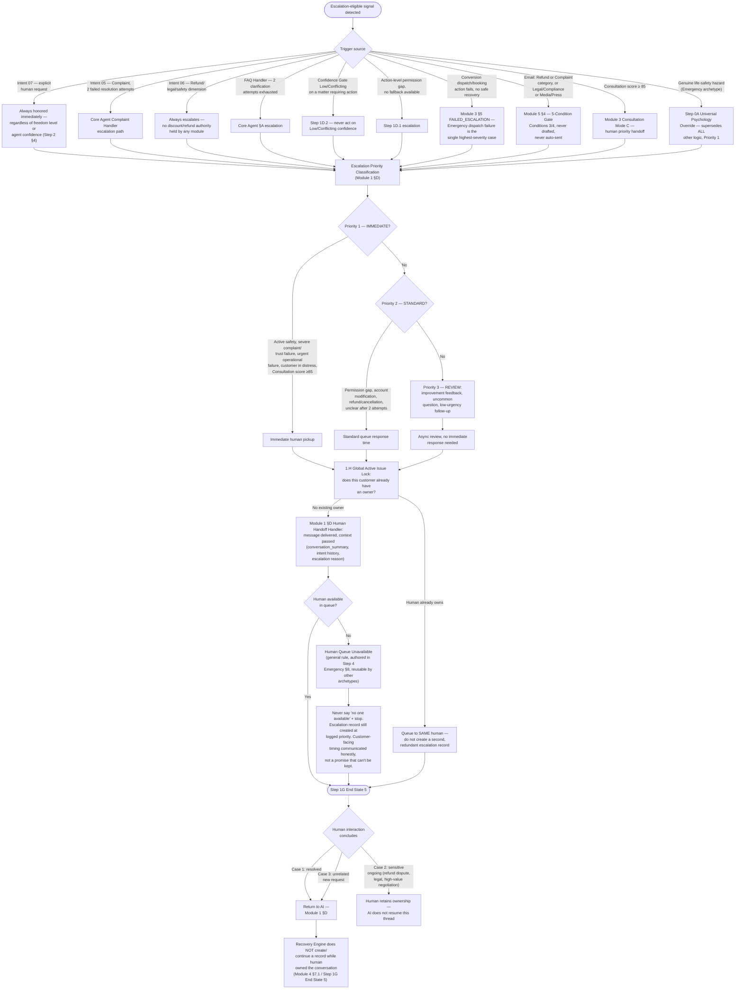

# Escalation Map

Source: `Agent_Runtime_System_v1.md` — Step 1E (Priority Order), Step 2 §4 (Freedom Boundary Enforcement — what requires human takeover regardless of freedom level), Module 1 §D (Human Handoff Handler + Escalation Priority Classification), Module 3 §5 (Failure Handling escalation cases), Module 4 §7.1 (Recovery Ownership), Module 5 §4 (5-Condition Gate escalation conditions), Step 1.H (Global Active Issue Lock), Step 4 Emergency §8 (Human Queue Unavailable — the general/reusable rule, authored against Emergency and cross-referenced by every other archetype's own Escalation Boundaries §8). This map covers the cross-module escalation mechanics shared by all 5 archetypes; each archetype's own additional, archetype-specific escalation triggers (e.g., Restaurant's safety-relevant dietary P2, Appointment's special-request P2/P3, Consultation's score ≥85 Mode C) are detailed in that archetype's own flowchart file, not duplicated here.

All escalation triggers across every module/step, unified into one routing map, with Escalation Priority Classification (P1/P2/P3) applied consistently.

