# Growth Agent Flow (Module 2)

Source: `Agent_Runtime_System_v1.md` — Step 3 Module 2, Sections A.0, A, B, B.1, C, D, E, and Handoff to Conversion Engine (Section 3).

All sub-flows including the Internal Conversation Recovery Flow. Active only if the Growth Agent module is ON.

```mermaid
flowchart TD
    Start([Intent 01/02 routed to Growth Agent]) --> Stage["A.0 Buying Stage Detection"]
    Stage --> StageType{Explorer / Evaluator /<br/>Ready Buyer?}
    StageType -->|Explorer| Educate[Educate, simplify,<br/>no conversion pressure]
    StageType -->|Evaluator| Support[Clarify comparison criteria,<br/>evidence-based]
    StageType -->|Ready Buyer| StopSelling["Stop selling, stop discovery —<br/>go straight to Handoff"]

    Educate --> Discovery["A. Discovery Flow"]
    Support --> Discovery

    Discovery --> Budget["Discovery Budget Rule (Step 2 §2.3):<br/>necessary? value exchanged? readiness signal?"]
    Budget --> BudgetCheck{All 3 pass?}
    BudgetCheck -->|No| SkipQ[Skip question, move to next step]
    BudgetCheck -->|Yes| AskQ["Ask — freedom band governs<br/>count/sequence/challenge authority"]
    AskQ --> NeedUnderstood{Need understood at<br/>sufficient confidence?}
    NeedUnderstood -->|Yes| Recommend
    NeedUnderstood -->|Buying signal appears| StopSelling
    NeedUnderstood -->|No, budget exhausted| SkipQ
    SkipQ --> Recommend

    Recommend["B. Recommendation Flow"]
    Recommend --> RecConf["Recommendation Confidence Requirement:<br/>1. Need understood? 2. Genuine match exists?<br/>3. Can explain in customer's own terms?"]
    RecConf --> RecCheck{All 3 checks pass?}
    RecCheck -->|No, no genuine match| NoSuitable["B.1 No Suitable Recommendation Handling"]
    RecCheck -->|No, understanding incomplete| Discovery
    RecCheck -->|Yes| Present[Present recommendation,<br/>freedom-band-gated max count]

    NoSuitable --> NSOption{Configured option}
    NSOption -->|A| Closest[Offer closest alternative,<br/>disclose the gap honestly]
    NSOption -->|B| EducatePath[Provide KB info to<br/>refine/reconsider need]
    NSOption -->|C| Handoff[Human Handoff Handler]
    Closest --> ExitEnd1([Step 1G End State 1 or 2])
    EducatePath --> ExitEnd1
    Handoff --> ExitEnd5([Step 1G End State 5])

    Present --> Tier2Trigger["Tier 2 Data Collection Trigger point<br/>(Step 0B) — offer value exchange if<br/>genuine preference expressed"]
    Tier2Trigger --> CustResp{Customer response?}
    CustResp -->|Positive, buying signal| ConvHandoff["Handoff to Conversion Engine<br/>(Section 3)"]
    CustResp -->|Hesitates| Objection["C. Objection Handling Flow"]
    CustResp -->|Declines outright| ExitEnd1

    Objection --> ObjType{Objection type?}
    ObjType -->|Price| PriceResp["Explain value, reframe —<br/>NO discount authority"]
    ObjType -->|Trust| TrustResp[Evidence/social-proof path]
    ObjType -->|Timing| TimingResp[Save-for-later, no pressure]
    ObjType -->|Confusion| ConfResp[Simplify — do not add choices]
    ObjType -->|Competitor| CompResp[Value-focused, never an attack]

    PriceResp --> ObjResolved{Resolved?}
    TrustResp --> ObjResolved
    TimingResp --> ObjResolved
    ConfResp --> ObjResolved
    CompResp --> ObjResolved

    ObjResolved -->|Yes| Present
    ObjResolved -->|Hesitation persists| Recovery["D. Internal Conversation<br/>Recovery Flow"]
    ObjResolved -->|Reveals genuine complaint| CoreComplaint["Re-classify Intent 05 →<br/>Core Agent Complaint Handler"]

    Recovery --> Signals["Signal detected: 'too expensive' /<br/>'not sure' / 'think about it' / 'maybe later' /<br/>competitor mention / long pause / tone drop"]
    Signals --> MapType["Map to same Price/Trust/Timing/Confusion<br/>taxonomy as Objection Handling (C)"]
    MapType --> ApplyResp["Apply matching (C) response"]
    ApplyResp --> StillHesitant{Hesitation<br/>remains?}
    StillHesitant -->|No| Present
    StillHesitant -->|Yes| RecGate{Recovery Engine<br/>module ON?}
    RecGate -->|Yes| CreateRecord["Create recovery opportunity<br/>(Module 4 trigger definition)"]
    RecGate -->|No| EndPositive["End conversation positively —<br/>no pressure, no repeated asks"]
    CreateRecord --> ExitEnd2([Step 1G End State 2])
    EndPositive --> ExitEnd2

    Present --> Opportunity["E. Opportunity Detection<br/>(only after primary need served)"]
    Opportunity --> OppSignal{Upsell signal present<br/>AND primary recommendation<br/>got positive response?}
    OppSignal -->|Yes, not in Complaint/Support<br/>context, not yet offered| OfferUpsell["Offer ONE upsell, optional framing —<br/>never re-offered if declined"]
    OppSignal -->|No| ConvHandoff
    OfferUpsell --> ConvHandoff

    ConvHandoff --> HandoffData["Package: selected_solution,<br/>Tier 2 contact if captured,<br/>resolved objection context"]
    HandoffData --> ConvGate{Conversion Engine<br/>module ON?}
    ConvGate -->|Yes| ToConversion([Hand to Conversion Engine — Module 3])
    ConvGate -->|No| ConvFallback["'I can share details, but purchases<br/>are handled by our team' + Tier 3<br/>capture offer or link (Step 1D.1)"]
```

