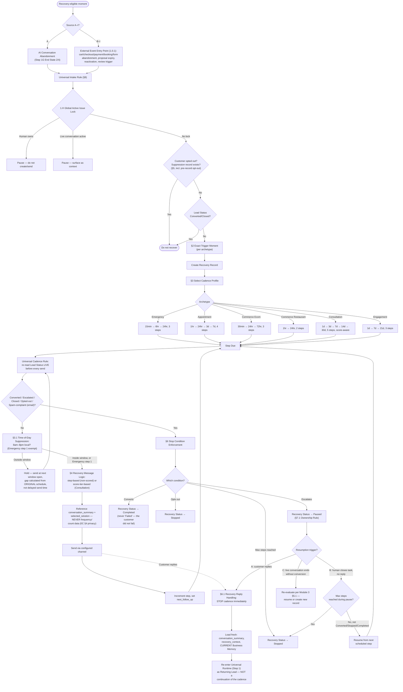

# Recovery Engine Flow (Module 4)

Source: `Agent_Runtime_System_v1.md` — Step 3 Module 4, Sections 2 (Trigger Definition), 3/3.1 (Profiles + Time Suppression), 4 (Message Logic), 5 (Suppression Rules incl. Pre-Record Opt-Out), 6/6.1 (Stop Conditions + Reply Handling), 7.1 (Ownership Rule), 8 (Enterprise Sources A–I).

Trigger → cadence → suppression → stop, across all 9 recovery-opportunity sources.

