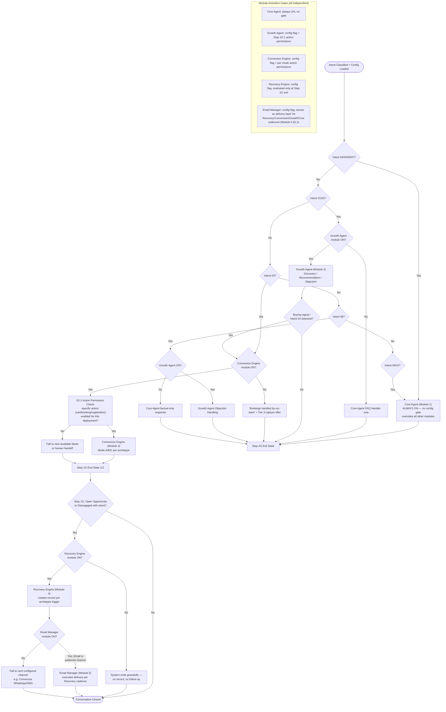

# Service Routing Map

Source: `Agent_Runtime_System_v1.md` — Step 1D (Module Routing), Step 1D.1 (Action Permission Check), and each module's own Purpose/Scope/Activation section (Module 1 §1, Module 2 §1, Module 3 §1, Module 4 §1, Module 5 §1).

Which module activates under which configuration state — module-level gate first, then action-level gate.

