# Universal Runtime Flow

Source: `Agent_Runtime_System_v1.md` — Step 1 (Sections 1.0, 1.0.1, 1A–1G, 1.H, including Batch 3's 1D.0.5 Module Responsibility Contract and 1D.3 Action Tool Execution Contract).

Full message routing from message receipt through session state, intent classification, config load, module routing, permission/confidence gates, intent switching, multi-intent resolution, and conversation exit — including the external-event entry point and the cross-module ownership lock.

```mermaid
flowchart TD
    Start([Message or External Event Received]) --> EventCheck{Customer message<br/>or external event?}

    EventCheck -->|External event| E1["1.0.1 Classify Event Type:<br/>SCHEDULED_TRIGGER / PLATFORM_WEBHOOK / SYSTEM_ALERT"]
    E1 --> E2["Load Business Config (1C, always current)"]
    E2 --> E3["Identify Affected Customer<br/>(contact method / order ID / session ID)"]
    E3 --> LockCheck{"1.H Global Active Issue Lock<br/>check"}
    LockCheck -->|Human owns issue| E4[Queue event, notify human]
    LockCheck -->|Active live conversation| E5[Surface as context, pause]
    LockCheck -->|No lock| E6[Route to appropriate module for event type]
    E4 --> EventEnd([Event processing complete])
    E5 --> EventEnd
    E6 --> ModuleHandle["Module handles event per own logic<br/>(Recovery cadence / Email outbound / Conversion lifecycle)"]
    ModuleHandle --> UpdateRecords[Update System Records]
    UpdateRecords --> EventEnd

    EventCheck -->|Customer message| S1["1A Session State Check"]
    S1 --> S1a{Session state?}
    S1a -->|New User| S1b[Full greeting + intent detection, no assumptions]
    S1a -->|Returning Lead| S1c[Load prior context, acknowledge lightly per Freshness Rules 0C 3.1]
    S1a -->|Existing Customer| S1d[Support mode priority by default]
    S1a -->|Dormant Customer| S1e[Cold Memory applies, light re-introduction]
    S1b --> Concurrent
    S1c --> Concurrent
    S1d --> Concurrent
    S1e --> Concurrent

    Concurrent{"Concurrent session<br/>detected? (1A dedup rule)"}
    Concurrent -->|Yes, same identity, within window| ConcHandle["Primary session continues;<br/>secondary acknowledged + redirected<br/>(or Priority 3 Review if distinct intent)"]
    Concurrent -->|No| B1

    ConcHandle --> B1["1B Intent Classification<br/>(10 intents, priority pre-assigned)"]
    B1 --> C1["1C Configuration Load<br/>(fresh every conversation)"]
    C1 --> C1a{Config missing/incomplete?}
    C1a -->|Yes| C1b[Fall back to Core Agent only;<br/>most conservative interpretation]
    C1a -->|No| D1
    C1b --> D1

    D1["1D Module Routing"]
    D1 --> D1a{Intent 04/05/06/07?}
    D1a -->|Yes| CoreSupport[Core Agent Support/Complaint/Handoff<br/>— overrides all other modules]
    D1a -->|No| D1b{Intent 01/02?}
    D1b -->|Yes, Growth ON| Revenue[Growth Agent Discovery/Recommendation]
    D1b -->|Yes, Growth OFF| CoreFAQ[Core Agent FAQ only]
    D1b -->|No| D1c{Intent 03?}
    D1c -->|Yes, Conversion ON| Conversion[Conversion Engine]
    D1c -->|Yes, Conversion OFF| ConvFallback["'I can share details, but bookings<br/>are handled by our team' + fallback"]
    D1c -->|No| D1d{Intent 08?}
    D1d -->|Yes, Growth ON| Objection[Growth Agent Objection Handling]
    D1d -->|Yes, Growth OFF| FactualOnly[Core Agent factual-only response]
    D1d -->|No| D1e{Intent 09/10?}
    D1e -->|Yes| CoreOffTopic[Core Agent Off-Topic / Context Recall]

    CoreSupport --> D1y
    Revenue --> D1y
    CoreFAQ --> D1y
    Conversion --> D1y
    ConvFallback --> D1y
    Objection --> D1y
    FactualOnly --> D1y
    CoreOffTopic --> D1y

    D1y{"1D.0.5 Module Responsibility Contract:<br/>does the routed module OWN this,<br/>or MUST TRANSFER?"}
    D1y -->|OWNS / ALLOWED| D1x["1D.1 Action Permission Check"]
    D1y -->|MUST TRANSFER| D1z[Transfer to owning module<br/>per Contract, independent of<br/>whether 1D routing was correct]
    D1z --> D1x

    D1x --> D1xa{Module permission +<br/>action permission granted?}
    D1xa -->|No| D1xb[Route to defined fallback, silently]
    D1xa -->|Yes| D2["1D.2 Confidence Gate"]
    D1xb --> D2

    D2 --> D2a{Confidence level?}
    D2a -->|High| Proceed[Proceed normally]
    D2a -->|Medium| Clarify[Ask minimum clarifying question]
    D2a -->|Low| Fallback["Clarify → Core Agent → Escalate"]
    D2a -->|Conflicting| ResolveConflict["Apply 0C priority order:<br/>Business > Session > Customer History > Assumption"]
    ResolveConflict --> Proceed

    Proceed --> E["1E Intent Switching &amp; Priority Check<br/>(runs before every response)"]
    Clarify --> E
    Fallback --> E

    E --> Ea{Intent changed since<br/>last message?}
    Ea -->|No| F
    Ea -->|Yes| Eb["Compare Priority 1–7,<br/>higher priority preempts, context preserved"]
    Eb --> F

    F["1F Multi-Intent Handling<br/>(if multiple components detected)"]
    F --> Fa{Blocking vs Supporting<br/>per component}
    Fa --> Fb[Answer Blocking components fully first]
    Fb --> Fc[Weave in Supporting components naturally]
    Fc --> G[Generate Response / Action]

    G --> G1{"Does this turn call an<br/>external tool — booking, cart,<br/>email send, webhook?"}
    G1 -->|Yes| G2["1D.3 Action Tool Execution Contract:<br/>REQUESTED → WAITING →<br/>SUCCESS / FAILED / TIMEOUT<br/>generalizes Module 3 §1.1/§5 system-wide"]
    G1 -->|No| H
    G2 --> H[Update Memory + System Records]
    H --> I["1G Conversation Exit Check"]
    I --> Ia{Exit state?}
    Ia -->|Goal achieved| End1[End State 1: Successful Completion]
    Ia -->|Engaged, no conversion| End2["End State 2: Open Opportunity<br/>→ Recovery Engine check"]
    Ia -->|Issue unresolved| End3[End State 3: Unresolved Issue]
    Ia -->|Silent, no response| End4["End State 4: Customer Disengaged<br/>→ Recovery Engine evaluation if meaningful intent"]
    Ia -->|Handed to human| End5["End State 5: Escalated to Human<br/>→ no recovery record while human owns"]

    End1 --> Wait([Wait for next message → loop restarts])
    End2 --> Wait
    End3 --> Wait
    End4 --> Wait
    End5 --> Wait
```

