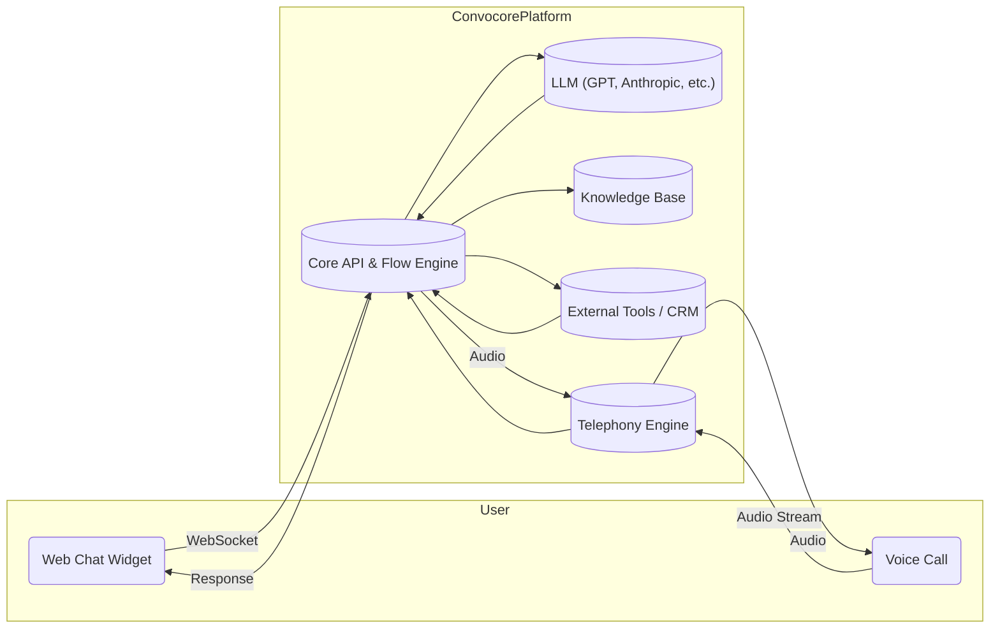
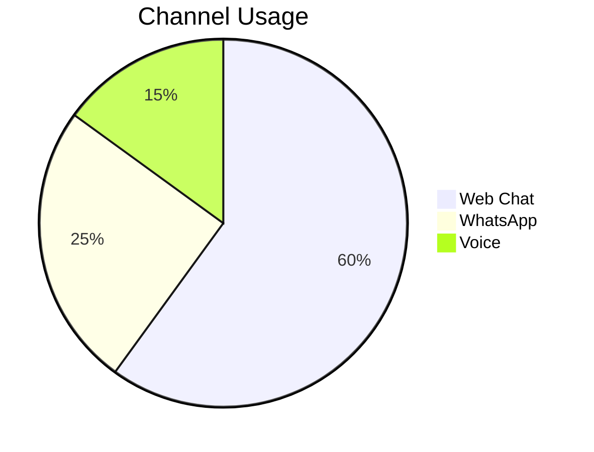
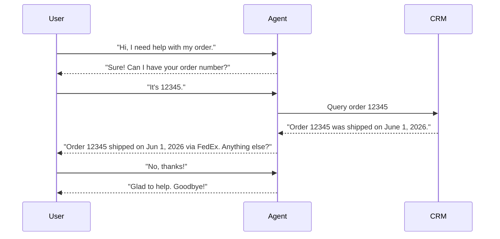

# Executive Summary  
Convocore is a full-stack **AI agent platform** (rebranded ConvoCore) for building conversational voice/text agents across web chat, WhatsApp, voice/SIP, and other channels. It provides a visual flow builder (Canvas), knowledge-base integration, analytics dashboards, and multi-tenant agency features. Core concepts include **Workspaces** (tenants), **Agents** (the bots), **Tools** (external API connectors), **Variables** (memory/context), and **Knowledge Base** (ingested docs). Convocore is accessed via REST APIs (V3) and a client-side JavaScript widget or SDK, with OAuth-style bearer tokens.  

In practice, you **(1)** create an agent (via UI or API), define its prompts and flows, and upload or scrape knowledge (e.g. company FAQs). You then embed the agent on your website (via script or iframe) or connect it to telephony (Twilio/SIP) and messaging channels. Convocore handles the conversation runtime, LLM calls, multi-channel routing, and analytics. The architecture includes the user interface (widget or call), the Convocore cloud backend (websocket/REST API, LLM integration, database), and optional external services (e.g. CRM APIs). Below is a typical architecture diagram:



## Core Concepts and Terminology  
- **Workspace**: A Convocore account or tenant (often an agency or client organization). It contains multiple agents and settings. Each workspace has a region (e.g. “EU” or “NA”) and **workspace secrets** (API keys) for authentication.  
- **Agent**: A single conversational AI bot. Created via UI or the V3 API. Agents have an ID and a secret API key (for programmatic use). Agents can be *text-only* or include *voice*, support multiple languages, and have configurable appearance (branding, avatar, theme).  
- **Tools**: Pre-built or custom connectors that an agent can call during conversations (e.g. look up customer data in a CRM, call an API, query a database). Convocore provides 40+ built-in integrations (calendars, CRM, e-commerce, Zapier, n8n, etc.) and a generic REST-API tool. Tools let your agent “execute” actions or fetch external info.  
- **Variables**: Key-value memory slots scoped to a session or user (for storing context like user name, order number, etc.). You define variables in the agent configuration and can read/write them in flows or system prompts. They enable personalized, stateful interactions.  
- **Knowledge Base (KB)**: A repository of documents (scraped websites, uploaded PDFs, text) that the agent can query. Convocore uses semantic search (retrieval) to find relevant chunks when answering queries. KBs allow the agent to “know” company-specific info. You add KB data via the dashboard or the V3 API.  
- **Canvas / Flows**: The visual flow builder where you define the conversation logic (nodes, conditions, transitions). You can also set **System Prompts** (instructions for the LLM), **Initial Messages** (greeting text), and follow-up “quick reply” buttons. Canvas nodes can call tools or transition to different states (hand off to human, end chat, etc.).  
- **Conversations / Interactions**: Instances of users talking to the agent. Convocore records transcripts, timestamps, and meta-data (user ID, origin channel, device, etc.) for analytics. The V3 API has *Conversations* endpoints to list past chats.  
- **Authentication**: All Convocore API calls use Bearer tokens. You can authenticate with a *workspace secret* (for workspace-wide ops) or an *agent secret* (for agent-specific ops). Keep secrets server-side only. The client-side widget only needs the **agent ID** and region, not the secret.

## Required Components  

- **Convocore Platform**: SaaS service itself (no self-hosting needed). You interact via its UI or APIs.  
- **REST API (V3)**: For managing workspaces, agents, KBs, etc. Base URLs are region-specific (e.g. `https://eu-gcp-api.vg-stuff.com/v3` or `https://na-gcp-api.vg-stuff.com/v3`). Use V3 for new projects; V2 is legacy.  
- **WebSocket API (Interact)**: For real-time chat streaming (especially for voice calls or web chat), use the WebSocket endpoints (`wss://eu-gcp-api.vg-stuff.com/interact` or NA). This provides turn-by-turn message streaming.  
- **Web Widget / SDK**: Convocore offers a JavaScript embed snippet and an NPM package (`@tixae-labs/web-sdk`) for web chat. The widget (configured via `window.VG_CONFIG`) handles the UI and connects to Convocore over WebSockets. No need to build your own front-end chat UI unless you want full control.  
- **Telephony / Voice**: For voice channels, you need a carrier. Convocore supports Twilio and SIP trunks. You provision phone numbers (via API) and Convocore handles inbound/outbound calls. For text-to-speech/speech-to-text, Convocore integrates many engines (e.g. Google/Gemini, ElevenLabs, Ultravox). Some require separate API keys (configured in workspace secrets).  
- **Databases / Storage**: Convocore stores agent data, transcripts, KB content on its backend. You *do not* need to provide DB storage for core operation. However, if you use external tools (like a CRM or logging), you may have your own databases (e.g. for custom logs, user records).  
- **Authentication**: Use HTTPS/TLS for all communications. Store API keys in secure environment variables or vaults (Convocore has a *credentials* tab for workspace secrets). Implement OAuth2 or API key validation on your services if exposing your own endpoints.  
- **CI/CD Tools**: (optional) Tools like GitHub Actions, Jenkins, etc., to automate deployment (agent import, config updates). Use the *Export/Import Agent Template* API for version controlling agent definitions.  

## Step-by-Step Local Development Setup  

1. **Sign Up and Create Workspace**: Register at the Convocore dashboard and create a workspace. Note the region (EU/NA) and copy your workspace secret key (found under *Settings → Credentials*). Keep it safe.  
2. **Obtain API Keys**: In your workspace settings, generate an **Agent Secret**. Each agent you create will also auto-generate its own secret (do not share these client-side).  
3. **Create Your First Agent**: Use the dashboard UI or the REST API. For example, via cURL (replace with your keys and workspace ID):  
   ```bash
   curl -X POST https://eu-gcp-api.vg-stuff.com/v3/agents \
     -H 'Authorization: Bearer <WORKSPACE_SECRET>' \
     -H 'Content-Type: application/json' \
     -d '{
       "agent": {
         "title": "My Customer Support Agent",
         "description": "Handles user support queries",
         "agentPlatform": "vg"  # for voice+GPT agents (vg = Voicify/Gemini)
       }
     }'
   ```  
   ```jsonc
   // Example response:
   {
     "success": true,
     "data": {
       "ID": "ag_123456789",
       "title": "My Customer Support Agent"
     }
   }
   ```  
   Note that a unique ID and secret API key are auto-generated. The agent now exists in your workspace.  
4. **Configure Agent Behavior**: In the UI or via API, set up prompts and flows:
   - **System Prompt**: Write initial instructions like *“You are a friendly customer support assistant”*. 
   - **Initial Message**: Default greeting shown when conversation starts.
   - **Knowledge Base**: Add documentation. For example, click *Knowledgebase → Add Source* in UI, or call the **Crawler API** to import web content. The agent will use this for answering queries.  
   - **Canvas Flows**: Define decision nodes, FAQs, and actions. For instance, create a flow where if user says “My order is late,” you branch to a node that calls a CRM tool to fetch order status. You can attach custom LLM instructions at any node. Example of setting an instruction in the start node via API:  
     ```json
     {
       "agent": {
         "nodes": [
           {
             "id": "__start__", "name": "Start",
             "instructions": "You are a helpful support agent for Acme Co. Always greet politely."
           }
         ]
       }
     }
     ```  
5. **Add Variables and Tools**: Define any session/user variables (e.g. `lastOrderId`). If needed, create *Tools* via API or UI for external integrations. For example, you might create a REST API tool for your CRM. In Canvas, drag a “Call API” block and select your tool.  
6. **Local Testing**:  
   - **Web Chat**: Create a simple HTML file and embed Convocore’s widget. Use the snippet from **Website Integration** docs (replace `YOUR_AGENT_ID` and region):  
     ```html
     <div id="VG_OVERLAY_CONTAINER"></div>
     <script defer>
       (function(){
         window.VG_CONFIG = {
           ID: "YOUR_AGENT_ID",
           region: "na",            // or "eu"
           render: "bottom-right",  // or "bottom-left"
         };
         var script = document.createElement("script");
         script.src = "https://vg-bunny-cdn.b-cdn.net/vg_live_build/vg_bundle.js";
         script.defer = true;
         document.body.appendChild(script);
       })();
     </script>
     ```  
     Open this page in your browser to test chat interactions. The widget will connect to Convocore and start a session with your agent. Pre-populate `VG_CONFIG.user` if you want to test passing user data (name, email, etc.).  
   - **Voice Call**: If you have a phone number (via Twilio/SIP), place a call to it. The agent should answer. You can also test via the dashboard’s “Call” simulator.  
   - **API Interaction**: Use the WebSocket API to simulate a chat. For example, in Python or Node you could open a WebSocket to `wss://<region>-gcp-api.vg-stuff.com/interact` and send a JSON message to emulate user input (per the **WebSocket Interact** spec).  
7. **Iteration**: As you test, refine prompts and flows. Convocore supports A/B testing by duplicating agents, so you can compare different wording or models. The **Testing & Configuration** docs suggests iterating on system prompts and reviewing transcripts to tune the agent’s tone.  

## Deployment Options  

Because Convocore is a cloud service, “deployment” mainly covers your own application components: the front-end or backend that interacts with Convocore. Here are common architectures:

| **Option**               | **Description / Use-Case**                                             | **Pros**                                         | **Cons**                                    |
|--------------------------|-----------------------------------------------------------------------|--------------------------------------------------|---------------------------------------------|
| **Static Site / CDN**    | Host a simple web page (with Convocore widget) on Netlify/Vercel/S3.   | Very low cost; high availability; auto-scaling CDN. | Limited backend logic (only client-side).   |
| **Cloud VM (AWS EC2, GCP Compute)** | Full control Linux server to run any code (Node, Python, etc.). | Full control; can deploy any services (webhooks, dashboards). | You manage OS, scaling; higher ops effort.  |
| **Container (Docker on ECS/K8s)** | Package backend as container.   | Portability; orchestrators (K8s) provide autoscaling, high availability. | More complex setup (orchestration required). |
| **Serverless (AWS Lambda, GCP Functions)** | Deploy backend logic as functions for webhooks, integrations. | Scalability, pay-per-use, no server management. | Cold-start latency; stateless (need external DB if needed). |
| **Hybrid (Containers + Serverless)** | Web front-end as static site; backend APIs as serverless. | Cost-efficient; each part uses best fit.  | More complexity in architecture management. |

**Examples:**  
- *Docker + Kubernetes:* You could build a small Node/Express service to handle webhooks or advanced logic. A Dockerfile might look like:  
  ```dockerfile
  FROM node:18
  WORKDIR /app
  COPY package.json ./
  RUN npm install
  COPY . .
  CMD ["node", "server.js"]
  ```  
  Deploy via Kubernetes or ECS. Kubernetes manifest snippet:  
  ```yaml
  apiVersion: apps/v1
  kind: Deployment
  metadata: { name: support-bot }
  spec:
    replicas: 3
    selector: { matchLabels: { app: support-bot } }
    template:
      metadata: { labels: { app: support-bot } }
      spec:
        containers:
        - name: bot
          image: yourrepo/support-bot:latest
          ports: [{ containerPort: 80 }]
  ```  
- *Serverless:* For webhook endpoints, you can use AWS Lambda + API Gateway. E.g., a simple AWS SAM template could deploy a Python/Lambda that calls Convocore API. This removes the need to manage servers and scales automatically on load spikes.  
- *Hosting the Widget:* Usually use a static hosting solution (e.g. your corporate web server, S3+CloudFront). The widget script is loaded from Convocore’s CDN (vg-bunny-cdn.b-cdn.net) so it’s optimized and cached globally.  

Choose providers (AWS, GCP, Azure) based on your existing infrastructure. All major clouds support container and serverless deployments. Use managed Kubernetes (EKS/GKE/AKS) or simple container services (ECS/Fargate) for containerization. Use CloudFront/AWS S3, Netlify, or similar for static hosting. For local testing, tools like [Serverless Framework](https://www.serverless.com/) can simulate AWS Lambda.

## Scaling Strategies  

Since Convocore itself scales transparently (they cite “<100ms latency, 99.9% uptime” and multi-region infrastructure), focus on scaling **your** components and data flows:  

- **Horizontal Scaling:** Deploy multiple instances of any backend service (webhooks, integration microservices). Use load balancers (AWS ALB, GCP LB) to distribute traffic. In Kubernetes, use an HPA (Horizontal Pod Autoscaler) on CPU/memory metrics.  
- **Vertical Scaling:** Increase instance size if a single service needs more memory/CPU (e.g. heavy processing of transcripts). Generally less flexible than horizontal.  
- **Autoscaling:** Configure cloud autoscaling groups or Kubernetes autoscalers. For serverless, concurrency limits handle this automatically.  
- **Load Balancing:** Route client traffic through a load balancer or CDN. For voice calls, use redundant SIP gateways or Twilio Elastic SIP trunking.  
- **Caching:**  
  - *API Responses:* If your agent calls the same external APIs frequently (e.g. product lookup), cache those responses (Redis/Cloud Memorystore) to reduce latency and cost.  
  - *Static Assets:* Use CDN caching for your web assets (widget code).  
  - *Knowledge Base Chunks:* Convocore caches processed embeddings internally; your agent queries are fast after initial ingestion.  
- **Partitioning:** If you have many clients, use separate Convocore *workspaces* per client to isolate data (Convocore supports client workspaces and whitelabeling).  
- **Shard LLM Calls:** If load is heavy, you might distribute conversations across multiple agents or even multiple Convocore accounts/regions.  

A typical scalable pipeline: Users → Global Load Balancer/CDN → Web app (container/pod) → Convocore cloud. For voice: Users → Telecom provider (Twilio/SIP) → Convocore voice engine. Ensure your backend (if any) can handle peak requests by pre-warming or autoscaling policies.

## Security and Compliance  

Convocore is built for enterprise use: **GDPR, SOC 2 Type II, and privacy-by-design** are explicitly supported. Key security practices include:

- **Authentication & Secrets:** Always use HTTPS/TLS 1.3. Store Convocore secret keys in secure vaults (not in code). Never expose secret keys client-side. For example, only send the **agent ID** to the browser, and keep the **agent secret** on your server. Rotate keys periodically, and use least-privilege: workspace secrets for admin tasks, agent secrets for agent-specific tasks.
- **Encryption:** Convocore encrypts all data in transit (TLS 1.3) and at rest (AES-256). If you store any PII or conversation logs on your end, apply similar encryption. Use secure KMS or HSM for key management.  
- **Network Security:** Use firewalls or security groups to restrict access to your services. If possible, run webhooks behind a VPN or VPC endpoint. Only allow trusted IPs to call your endpoints.  
- **Input Sanitization:** Your agents may process user input. Although the LLM handles most text, if you pass input to external tools or databases, sanitize to prevent injection attacks.  
- **Data Minimization & Retention:** Only collect user info needed for service. Don’t store unnecessary PII. Convocore’s compliance docs note *data minimization*, *privacy by design*. Implement a data retention policy: e.g., purge conversation logs older than N days if not needed. Use Convocore’s API to delete transcripts or leads if required.  
- **Consent:** For regions with privacy laws, obtain user consent before logging their data. For example, only pre-populate `VG_CONFIG.user` (name/email) when the user agrees. Provide an option to delete personal data (user profile, transcripts) to comply with GDPR.  
- **PII Handling:** Mark and encrypt any fields that contain PII. If using tools, ensure third-party data handling complies with policy. Train the agent to not elicit sensitive info (or handle it securely).  
- **Audit Logging:** Enable Convocore’s access logs via the dashboard. On your side, log key events (deploys, errors) to a central log (e.g. ELK or CloudWatch) with restricted access.  
- **Regulatory Compliance:** Beyond GDPR, consider PCI DSS if taking payments, HIPAA for health data, etc. Use separate Convocore workspaces if isolating data per compliance.  
- **Whitelabel & Multi-Tenancy:** If operating for multiple clients, use Convocore’s whitelabel features to isolate each client’s data and branding. Each client/workspace has separate credentials and analytics.

By design, Convocore already states **enterprise-grade security**: SOC2, GDPR, and data encryption. Leverage those assurances, and follow your cloud provider’s best practices (IAM roles, encrypted disks, etc.). Regularly review security advisories and rotate keys.

## Observability  

Monitoring a conversational AI involves tracking usage, performance, and reliability:

- **Logging:**  
  - *Convocore Logs:* Use the Dashboard (and API) to retrieve conversation transcripts, errors, and handoff events. Convocore logs each message turn with metadata (timestamps, duration, channel). For custom services (webhooks/tools), log requests/responses, including correlation IDs to link them to conversations.  
  - *Error Logs:* Capture and aggregate any exceptions in your backend (e.g. invalid API calls, timeouts). Use a logging service (e.g. CloudWatch, Logstash).  
- **Metrics:**  
  - *Usage:* Track total conversations, unique users, messages per user. Convocore’s Analytics page provides many of these out-of-the-box (charts for interactions, intents, retention, token usage).  
  - *Performance:* Monitor API latency (Convocore vs your code), time to first response, voice latency. For example, measure time from user message to agent reply; the analytics dashboard shows average seconds per chat.  
  - *Cost Metrics:* Track API call counts, LLM token usage (the UI shows tokens over time), telephony minutes. Use alerts if usage spikes unexpectedly.  
  - *Health:* Use synthetic tests to simulate chats/calls (e.g. ping your webhook or the agent) and measure response.  
- **Distributed Tracing:** If you have microservices, implement tracing (e.g. OpenTelemetry) to follow a request through your system and to Convocore. Tag Convocore API calls and responses with trace IDs.  
- **Alerts:** Set up alerts for thresholds: e.g. >90% of API calls failing (500 errors), response time >2s, conversation dropoff rate, etc. Integrate with PagerDuty or Slack. Monitor Convocore’s status page (status.convocore.ai) for any service issues.  
- **Dashboards:** Use Prometheus/Grafana or Cloud-native dashboards. Example metrics to chart: 
  ```text
  total_conversations_count, avg_response_time, intent_success_rate, active_users, error_rate_per_service
  ```  
- **Analytics & Reporting:** Convocore’s built-in Analytics dashboard provides charts for monthly interactions, message understanding, and user retention. Regularly review these, and export data via the API if you need custom BI. For example, a retention plot or intent pie chart can highlight drop-off points or misunderstanding (use sequence diagrams or charts as needed).

A sample retention chart from Convocore (mock data):  


## CI/CD Pipeline  

Automate your agent delivery just like code:

1. **Version Control:** Store your agent template JSON in Git. Use the **Export Agent Template** API to get a JSON of nodes, tools, variables. Commit this (minus secrets) to a repo. For example:  
   ```bash
   curl -H "Authorization: Bearer <token>" \
     https://eu-gcp-api.vg-stuff.com/v3/agents/ag_123/export-template \
     -o agent-template.json
   ```  
2. **CI Pipeline:** On commit, trigger a CI job (GitHub Actions/GitLab CI). It can:  
   - Lint/validate JSON.  
   - Call **Import Agent Template** API to update a test agent (or create one).  
   - Run automated tests (e.g. send a test message via API and assert expected answer).  
   - If successful, tag and possibly call import on production agent.  

   Example GitHub Actions (YAML):  
   ```yaml
   name: Deploy Agent
   on: [push]
   jobs:
     deploy:
       runs-on: ubuntu-latest
       steps:
       - uses: actions/checkout@v2
       - name: Import Agent Template
         run: |
           curl -X POST https://eu-gcp-api.vg-stuff.com/v3/agents/import-template \
             -H "Authorization: Bearer ${{ secrets.CONVOKORE_WORKSPACE_SECRET }}" \
             -H "Content-Type: application/json" \
             -d @agent-template.json
   ```  
3. **Staging vs Prod:** Use separate Convocore workspaces or agents for testing. After CI validates in staging, promote to production.  
4. **Secrets Management:** Store API keys in CI secrets or Vault. Rotate keys by updating the workspace secrets in Convocore (changes take effect immediately).  
5. **Release Management:** Tag releases, maintain changelog of agent updates. Keep full export snapshots to rollback if needed. Convocore notes that **agent exports exclude secrets**, so be sure any confidential info is handled via workspace secrets only.  

## Testing  

- **Unit Tests:** For any custom code (tools/webhooks), write unit tests (e.g. using Jest or pytest). For conversation logic, you can simulate LLM prompts by mocking tools and verifying the flow transitions.  
- **Integration Tests:** Use Convocore’s API or WebSockets to simulate user messages. For example, open a WebSocket session (`wss://.../interact`), send a JSON message with `"action":{"type":"text","payload":"Hello"}`, and verify the agent’s JSON response structure contains expected text. This tests end-to-end flow (via Convocore runtime).  
- **End-to-End Tests:** Automate actual UI or telephony tests: 
  - *Web Chat:* Use Selenium or Cypress to open your page with the widget, send a message, and assert the bot’s reply text. 
  - *Voice:* Use Twilio’s test numbers or call recordings to simulate speech. Verify audio responses using transcriptions.  
- **Load Testing:** Simulate many concurrent chats to ensure scaling. Tools like k6 or Apache JMeter can create WebSocket load on the Convocore API (V3 or V2) to mimic high traffic. Gradually increase load until response times degrade, then adjust autoscaling. Also test with bursts (e.g. 1000 simultaneous users).  
- **A/B Testing:** Convocore supports multiple agent versions for A/B. Use it to compare different prompts or models. Evaluate which version has better user satisfaction (via analytics or user surveys).  
- **Test Cases:** Develop conversation test cases (sample dialogs). Example script:  
   ```text
   Test Case: Order Status Lookup
   User: "Hi, can you tell me where my order is?"
   Bot should: Ask for order number.
   User: "Order number is 12345."
   Bot should: Query CRM via tool, respond with "Order 12345 shipped on [date]." and confirm fulfillment.
   ```  
Automation can be done with scripting the WebSocket API.

## Cost Optimization  

- **LLM Costs:** Convocore uses GPT (and others). Token usage is billed. Monitor token usage (Analytics shows token counts). To reduce cost:  
  - Use smaller models (e.g. GPT-3.5 vs GPT-4) where acceptable.  
  - Set token limits (`vg_maxTokens`) or lower `temperature` for deterministic replies.  
  - Use retrieval (KB) heavily so the LLM generates less.  
- **Compute / Hosting:** Use serverless for spiky loads (pay per request). Shut down idle containers. Use reserved instances if predictable. For static hosting, free tier (GitHub Pages, Netlify) might suffice.  
- **Voice Call Costs:** Twilio/SIP charges per minute; choose pricing plans wisely. Use silence detection to end calls that go unanswered (Convocore auto-hangup after timeout).  
- **Scaling Economies:** Leverage auto-scaling to only run extra instances when needed. Use spot instances or cheaper VM types if acceptable.  
- **Monitoring for Optimization:** Track budgets. E.g. if API calls surge due to a bug (e.g. infinite loop in flow), your metrics/alerts should catch it before costs blow up.

## Backup and Disaster Recovery  

- **Agent Configuration:** Regularly **export agent templates** (using API) and store them in version control or backup storage. In disaster, you can import to a new agent.  
- **Knowledge Base:** Export or archive your KB documents (raw files or scraped data). If using Convocore’s crawler, re-scrape periodically and store results.  
- **Data Backup:** While Convocore handles data persistence, you may want backups of conversation logs or leads. Use the *Conversations* and *Leads* API to export data to your DB or blob storage (CSV/JSON) as a backup.  
- **Multi-Region Redundancy:** Use both EU and NA regions for global clients. If one region fails, your account likely can’t switch region; plan with Convocore support. Alternatively, duplicate critical agents in both regions.  
- **Telephony Backup:** Have alternative call flows: e.g. if the VoIP provider fails, redirect calls to a backup number.  
- **Business Continuity:** Document recovery steps (e.g. regenerate keys, re-import agents, failover domain names). Test your backups by doing a mock restore periodically.  

## Troubleshooting  

- **Authentication Errors:** If API calls return 401, check you’re using the correct secret (workspace vs agent) and region URL. Ensure the workspace and agent IDs match the token’s region.  
- **Agent Not Responding:** Verify the agent is enabled (`enabled=true`). Check that **enableNodes** or platform is set (some agents default to disabled without nodes). Ensure your canvas has a “Start” node with instructions.  
- **Wrong Region:** A common mistake is using the EU endpoint with a NA workspace (or vice versa). This yields 404 or data mismatch. Always use the region-matched API URL.  
- **Widget Issues:** If the chat widget doesn’t appear, check browser console for errors. Ensure `YOUR_AGENT_ID` is correct, and that the script from `vg_bundle.js` is loaded (no Content-Security-Policy blocking). Verify the `VG_OVERLAY_CONTAINER` div exists.  
- **Voice Call Quality:** If speech is unclear, switch voice providers (e.g. Ultravox vs Gemini). Check latency logs. If calls drop, check telephony logs (Twilio debug).  
- **Misunderstood Queries:** If the agent frequently fails to answer, use the **Analytics → Top Intents / Understood Messages** charts to see common failures. Adjust prompts or add training phrases.  
- **API Rate Limits:** Convocore has rate limits per plan. If you hit limits, the API returns 429. Implement retries with backoff, or upgrade your plan.  
- **Logs and Support:** Use `status.convocore.ai` for service status. Join Convocore Discord or support email for unresolved issues. The docs suggest contacting support for account/billing or implementation questions.

## Code Snippets and Configuration Examples  

**Create Agent (cURL/JSON)**:  
```bash
curl -X POST \
  https://eu-gcp-api.vg-stuff.com/v3/agents \
  -H "Authorization: Bearer <WORKSPACE_SECRET>" \
  -H "Content-Type: application/json" \
  -d '{"agent": {"title": "SupportBot", "description": "Helps customers", "agentPlatform": "vg"}}'
```  

**Export/Import Agent (cURL/JSON)**:  
```bash
# Export
curl -H "Authorization: Bearer <WORKSPACE_SECRET>" \
  https://eu-gcp-api.vg-stuff.com/v3/agents/ag_123/export-template \
  -o template.json

# Later, import
curl -X POST -H "Authorization: Bearer <WORKSPACE_SECRET>" \
  -H "Content-Type: application/json" \
  -d @template.json \
  https://eu-gcp-api.vg-stuff.com/v3/agents/import-template
```

**Widget Embed (HTML)**:  
```html
<!-- Place this before </body> -->
<div id="VG_OVERLAY_CONTAINER"></div>
<script defer>
 (function(){
   window.VG_CONFIG = {
     ID: "YOUR_AGENT_ID",
     region: "na",          // or 'eu'
     render: "bottom-right"
   };
   let s = document.createElement("script");
   s.src = "https://vg-bunny-cdn.b-cdn.net/vg_live_build/vg_bundle.js";
   s.defer = true;
   document.body.appendChild(s);
 })();
</script>
```  
This initializes the chat widget. Optionally add `user: {name,email,phone}`, `userID`, or `autostart: true` to `VG_CONFIG` for personalization.

**Dockerfile Example** (for a Node webhook service):  
```dockerfile
FROM node:20-alpine
WORKDIR /app
COPY package*.json ./
RUN npm install --production
COPY . .
ENV NODE_ENV=production
CMD ["node", "webhook-server.js"]
```

**Kubernetes Service (YAML)**:  
```yaml
apiVersion: v1
kind: Service
metadata:
  name: support-bot-service
spec:
  type: LoadBalancer
  selector:
    app: support-bot
  ports:
    - protocol: TCP
      port: 80
      targetPort: 3000
```

**Conversation Flow (Mermaid)**:  


**Prompt Engineering Tips:**  
- Start with a clear **System Prompt** (agent persona, style). Example: *“You are a friendly customer support assistant for ACME Corp. Speak clearly and helpfully.”*  
- Provide **few-shot examples** if needed (Convocore supports prepended context via nodes).  
- Use **follow-up buttons** (Quick Replies) for common next steps to guide the user (e.g. “Check order status”, “Speak to agent”).  
- Keep prompts concise. Use **temperature** to control randomness: 0.0 for factual answers, 0.7 for creativity.  
- Leverage the **Knowledge Base**: Direct the LLM to “search internal docs if possible” by phrasing: *“If unsure, check the knowledge base for any matching information.”* in the system prompt.  
- Test and iterate: record transcripts (Conversation API) and refine prompts for misunderstood queries.

## Sample Data Schema  

Convocore structures conversation and user data into JSON. A typical **transcriptMetadata** (from the WebSocket API) looks like:  
```jsonc
{
  "ID": "<conversationID>",
  "userID": "<custom-user-id>",
  "userName": "<name>",
  "userEmail": "<email>",
  "userPhone": "<phone>",
  "origin": "web-chat",   // channel
  "ts": 1681234567890,    // timestamp
  "messagesNum": 3,
  "lastMessageTS": 1681234570000,
  // ... other fields ...
}
```
*(see API docs for full schema)*

Within your app, you might model user/session data as:  
```json
{
  "user": {
    "id": "user_abc123",
    "name": "Alice Smith",
    "email": "[email protected]"
  },
  "session": {
    "id": "session_xyz789",
    "startedAt": "2026-06-30T12:34:56Z",
    "context": {
      "lastIntent": "order_status",
      "variables": {
        "lastOrder": "12345"
      }
    }
  },
  "conversation": [
    {"sender": "user", "text": "Hi, I need help with my order.", "ts": "..."},
    {"sender": "agent", "text": "Sure! Can I have your order number?", "ts": "..."},
    // ...
  ]
}
```
Store any needed context (like `lastOrder`) in **variables** so the agent can recall it between turns or even sessions.  

## Integration Patterns (CRM / Knowledge Base)  

- **CRM (e.g. Salesforce/HubSpot):** Use Convocore *Tools* to query the CRM API. E.g., create a “Salesforce Lookup” tool in Convocore (via API or UI) that sends the order number to Salesforce and returns status. In Canvas, after capturing the order ID variable, use a “Call Tool” node to fetch customer data, then feed it into the agent’s response.  
- **Knowledge Base (Internal Docs):** Use Convocore’s **Crawler** to ingest your FAQ or knowledge docs. This could be done by pointing to your help site URL or uploading PDF manuals. The agent will automatically include relevant snippets in its answers. For external KBs (like Zendesk), either export the FAQ data into a supported format or write a custom tool to call the Zendesk API and feed it to the agent.  
- **Webhooks:** If a needed integration isn’t available, use Convocore’s HTTP tool to call your own webhook, which runs custom logic (e.g. database query, enterprise API). For example, on user request, the agent node “Webhook: Check Subscription” could POST to your endpoint. Return the result to the agent via the JSON response.  
- **Omnichannel:** A single Convocore agent can handle web chat, WhatsApp, SMS, Facebook, etc. For WhatsApp, connect via Twilio or Meta Business API; for Facebook/IG via native integration. No code is needed to switch channels – the agent ID is the same. Ensure your UI flows accommodate each channel’s UI (quick replies on web vs. templates on WhatsApp).  
- **Handoff:** Integrate with a live chat or ticketing system for handoff. For example, if user says “I want to talk to human,” use a Tool to create a ticket in Zendesk or route the conversation ID to a Slack channel for support agents.  

The key pattern is **tool invocation** within the conversation flow. Tools allow bridging Convocore’s AI with your backend systems (CRM, KB, databases). Combined with variables and node conditions, you can build dynamic, context-aware dialogues without writing the conversation logic in code.

## Deployment Options Table  

**Comparison of Deployment Strategies:**  

| **Approach**       | **Description**                               | **Pros**                                           | **Cons**                                     |
|--------------------|-----------------------------------------------|----------------------------------------------------|----------------------------------------------|
| **Static Web Chat** | Embed via HTML/JS on website or SPA.         | Easiest to deploy; auto-scaled; no server to manage. | Limited to front-end; cannot handle complex logic (just what agent does). |
| **NPM / React SDK** | Use `@tixae-labs/web-sdk` in a React/Vue app (SPA). | Full control, versioning; integrates with app state; supports event hooks. | Requires build process; larger bundle; still no private logic on client. |
| **Serverless Backend** | Functions (AWS Lambda, Google Cloud Functions) running code. | Scales to zero; cost-effective for sporadic calls; no VM management. | Cold starts; limited runtime; need external DB for state. |
| **Docker Container** | Host a custom integration API or dashboard. | Portability; can bundle any runtime/library; easy to test locally. | Must manage servers/cluster; patching OS; overkill for simple tasks. |
| **PaaS (e.g. Heroku, Cloud Run)** | Managed container or app service. | Simplified deployment; handles scaling; free tiers available. | Less control over environment; can be costly at scale; vendor lock-in. |
| **Kubernetes Cluster** | Orchestrated containers (AKS/EKS/GKE). | Fine-grained control; auto-scaling; ideal for microservice architectures. | Complex setup; operational overhead; not needed for small apps. |

Choose based on team skill and needs. For example, a support chatbot with minimal backend might just use a static site for the widget and a few serverless functions for webhooks. An enterprise system with many integrations might deploy containerized microservices on Kubernetes.

## Conclusion  

Building a customer support AI agent with Convocore involves orchestrating **multiple components**: the Convocore SaaS (agent, KB, flows), your web/telephony interfaces, and any external systems (CRM, databases). This guide covered everything from initial setup to advanced topics (security, scaling, CI/CD, testing, etc.). Key takeaways:

- Convocore handles the heavy AI orchestration (models, deployment, analytics), so you focus on design: writing prompts, mapping flows, and integrating data.
- Use the **REST and WebSocket APIs** for automation and custom integrations. Manage agent definitions via template export/import to enable DevOps practices.
- Secure your deployment: keep keys secret, encrypt data, and comply with GDPR and other regulations.
- Monitor usage and performance with Convocore’s built-in analytics and your own logging/metrics. Scale your own services independently to handle user load.
- Test thoroughly: simulate conversations, unit-test your code, and use load testing before going live.
- Leverage the multichannel nature: one Convocore agent can serve web chat, phone, SMS, and social channels simultaneously, providing an omnichannel support experience.
- Finally, iterate on conversation design and prompts based on user feedback and analytics to continuously improve quality.

**Sources:** Official Convocore documentation and product site, which provide detailed guidance on all aspects of building and deploying agents. These have been synthesized here into a comprehensive setup and operations guide.